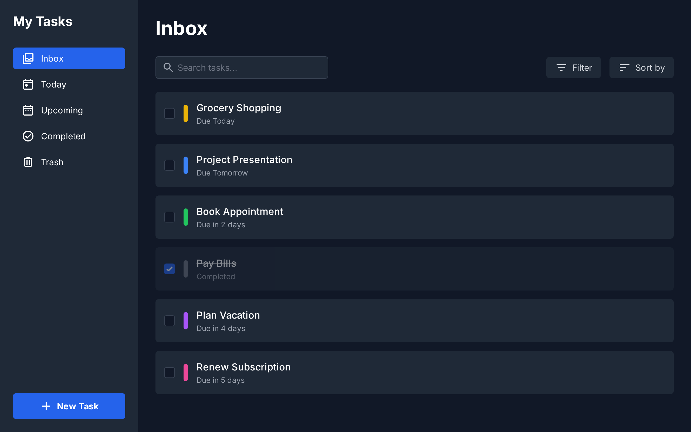

# TaskApp - Advanced Task Management System

A comprehensive, full-featured task management application built with Next.js, featuring time-based notifications, email integration, and a modern dark-themed UI.



## 🚀 Features

### Core Task Management
- ✅ **Create Tasks** - Add tasks with titles, descriptions, due dates, times, priorities, and categories
- ✅ **Edit Tasks** - Comprehensive editing with all fields modifiable
- ✅ **Delete Tasks** - Remove tasks with confirmation dialogs
- ✅ **Mark Complete** - Toggle task completion status with celebration animations
- ✅ **Task Organization** - Categorize and tag tasks for better organization

### Time-Based Features
- ⏰ **Due Time Support** - Set specific times for task deadlines
- 📅 **Multiple Views** - Inbox, Today, Upcoming, and Completed task views
- 🔔 **Smart Notifications** - Browser push notifications at 15 min, 1 hour, and 1 day before due time
- 📧 **Email Reminders** - Automated email notifications for task completions and reminders
- ⚠️ **Overdue Detection** - Automatic identification and highlighting of overdue tasks

### Email Integration
- 📬 **Multiple Providers** - Support for Web3Forms, EmailJS, and Custom API providers
- 📄 **Professional Templates** - Beautifully formatted email templates for completions and reminders
- ⚙️ **Configurable Settings** - Easy setup through the settings page
- 🔐 **Secure Configuration** - API keys stored securely in localStorage

### User Interface
- 🌙 **Dark Theme** - Modern, eye-friendly dark interface
- 📱 **Responsive Design** - Works perfectly on desktop, tablet, and mobile devices
- 🔍 **Advanced Search** - Search across task names, descriptions, categories, and tags
- 🎨 **Color-Coded Tasks** - Visual organization with customizable task colors
- ✨ **Smooth Animations** - Polished interactions and transitions

## 🛠️ Technology Stack

- **Frontend**: Next.js 15.5.3 with App Router, React 19.1.0, TypeScript
- **State Management**: Redux Toolkit with persistent state
- **Database**: Firebase Firestore for real-time data synchronization
- **Styling**: Tailwind CSS with custom animations
- **Notifications**: Browser Notification API, EmailJS integration
- **Build Tools**: Turbopack for fast development builds

## 📦 Installation

1. **Clone the repository**
   ```bash
   git clone https://github.com/subash43e/taskapp.git
   cd taskapp
   ```

2. **Install dependencies**
   ```bash
   npm install
   ```

3. **Set up Firebase**
   - Create a new Firebase project at [Firebase Console](https://console.firebase.google.com/)
   - Enable Firestore Database
   - Copy your Firebase config to `src/Firebase/firebase.ts`

4. **Configure Email Service (Optional)**
   - For EmailJS: Sign up at [EmailJS](https://www.emailjs.com/) and get your service details
   - For Web3Forms: Get your access key from [Web3Forms](https://web3forms.com/)
   - Configure through the app's Settings page

5. **Start the development server**
   ```bash
   npm run dev
   ```

6. **Open your browser**
   Navigate to [http://localhost:3000](http://localhost:3000)

## 🏗️ Project Structure

```
taskapp/
├── src/
│   ├── app/                    # Next.js App Router pages
│   │   ├── Inbox/             # Inbox view page
│   │   ├── Today/             # Today's tasks page
│   │   ├── Upcoming/          # Upcoming tasks page
│   │   ├── Completed/         # Completed tasks page
│   │   └── Settings/          # Settings configuration page
│   ├── Components/            # Reusable React components
│   │   ├── MainLayout.tsx     # Main app layout with modals
│   │   ├── NavBar/            # Navigation bar component
│   │   ├── Sidebar/           # Navigation sidebar
│   │   ├── Task_Card/         # Individual task display
│   │   ├── Task_Creation/     # Task creation modal
│   │   ├── TaskEdit/          # Task editing modal
│   │   └── SearchBar/         # Search functionality
│   ├── Firebase/              # Firebase configuration
│   ├── services/              # External service integrations
│   │   ├── emailNotificationService.ts
│   │   └── notificationScheduler.ts
│   └── store/                 # Redux state management
├── public/                    # Static assets
└── package.json              # Project dependencies
```

## 🔧 Configuration

### Firebase Setup
Update `src/Firebase/firebase.ts` with your Firebase credentials:
```typescript
const firebaseConfig = {
  apiKey: "your-api-key",
  authDomain: "your-project.firebaseapp.com",
  projectId: "your-project-id",
  storageBucket: "your-project.appspot.com",
  messagingSenderId: "123456789",
  appId: "your-app-id"
};
```

### Email Service Configuration
Configure email services through the Settings page in the app:

1. **EmailJS Configuration**
   - Service ID from your EmailJS dashboard
   - Template ID for your email template
   - Public Key from EmailJS

2. **Web3Forms Configuration**
   - Access Key from Web3Forms dashboard

3. **Custom API Configuration**
   - Your custom email API endpoint
   - Required authentication headers

## 📱 Usage Guide

### Creating Tasks
1. Click the "+" button in the navigation
2. Fill in task details:
   - Task name (required)
   - Description
   - Due date and time
   - Priority level
   - Category
   - Tags
3. Click "Create Task"

### Managing Tasks
- **Edit**: Click the three dots (⋮) on any task card → "Edit"
- **Delete**: Click the three dots (⋮) on any task card → "Delete"
- **Complete**: Click the checkbox to mark as complete
- **Search**: Use the search bar to find specific tasks

### Notifications
- **Browser Notifications**: Automatic reminders before due times
- **Email Notifications**: Sent for task completions and reminders
- **Settings**: Configure notification preferences in the Settings page

### Navigation
- **Inbox**: View all active tasks
- **Today**: Tasks due today
- **Upcoming**: Future tasks organized by date
- **Completed**: Finished tasks archive
- **Settings**: Configure app preferences

## 🎯 Key Features Explained

### Smart Notification System
The app includes an intelligent notification scheduler that:
- Sends browser notifications at multiple intervals (15 min, 1 hour, 1 day before)
- Handles timezone differences automatically
- Works offline using localStorage for scheduled notifications
- Respects user's notification permissions

### Email Integration
Professional email notifications with:
- HTML-formatted templates for better presentation
- Support for multiple email service providers
- Automatic retry mechanisms for failed sends
- Configurable email preferences per user

### Real-time Data Sync
Using Firebase Firestore for:
- Instant updates across multiple devices
- Offline support with automatic sync when reconnected
- Scalable real-time database operations
- Secure data storage with configurable rules

## 🚀 Deployment

### Vercel (Recommended)
1. Connect your GitHub repository to Vercel
2. Add environment variables for Firebase configuration
3. Deploy automatically on every push to main branch

### Manual Deployment
1. Build the application:
   ```bash
   npm run build
   ```
2. Deploy the `out` folder to your hosting service

## 🤝 Contributing

1. Fork the repository
2. Create a feature branch (`git checkout -b feature/AmazingFeature`)
3. Commit your changes (`git commit -m 'Add some AmazingFeature'`)
4. Push to the branch (`git push origin feature/AmazingFeature`)
5. Open a Pull Request

## 📝 License

This project is licensed under the MIT License - see the LICENSE file for details.

## 🔮 Future Enhancements

- [ ] Team collaboration features
- [ ] Advanced task filtering and sorting
- [ ] Task templates and recurring tasks
- [ ] Time tracking and productivity analytics
- [ ] Mobile app development
- [ ] Integration with calendar applications
- [ ] Advanced reporting and exports

## 📧 Support

For support, email subash43e@gmail.com or create an issue in the GitHub repository.

---

**Built with ❤️ using Next.js, React, and modern web technologies**
